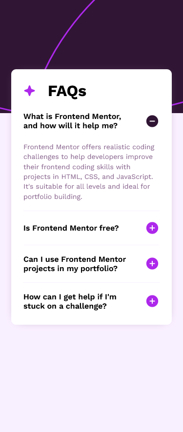
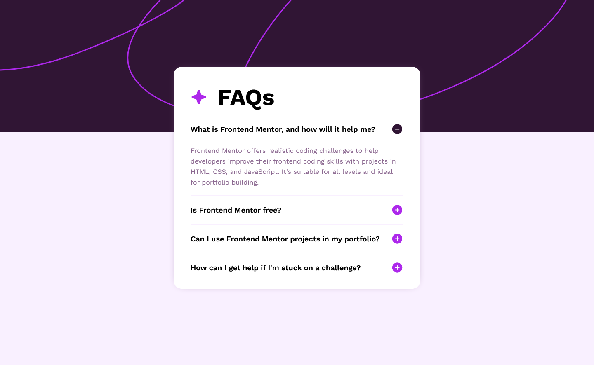

## Overview
This is my solution for front-end mentor challenge name: [FAQ accordion](https://www.frontendmentor.io/challenges/faq-accordion-wyfFdeBwBz)

### Screenshot
Mobile view\

desktop view\

# Demo
[FireShot](https://wajidkhan2-frontendmentor-challenges.github.io/FAQ-accordion-fm-html-css/)

### Built with
- Mobile-first workflow
- Semantic HTML5 markup
- CSS custom properties
- JS
